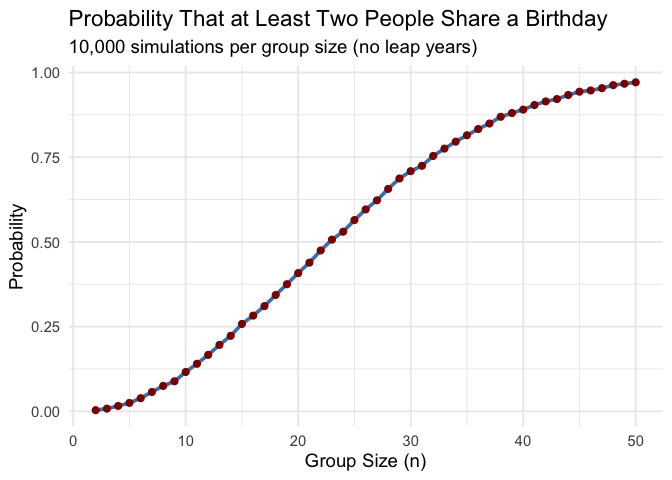
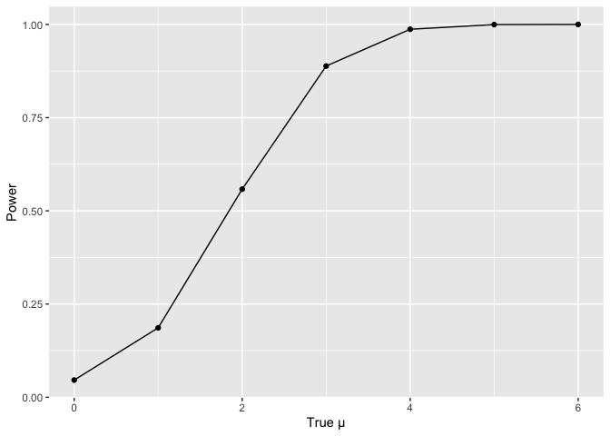
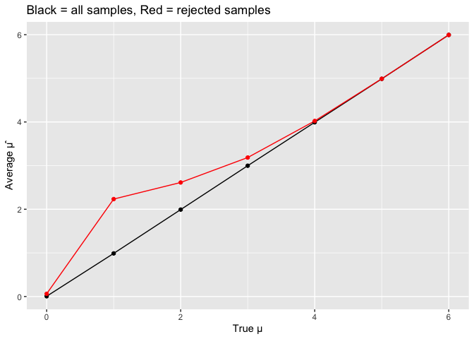
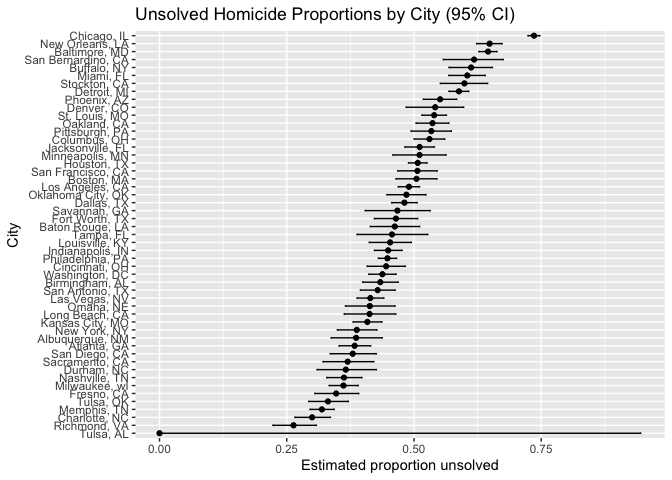

hw5
================
2025-11-11

## Problem1

``` r
# Function to simulate whether at least two people share a birthday
same_birthday <- function(n) {
  
  birthdays <- sample(1:365, size = n, replace = TRUE)
  
  has_duplicate <- any(duplicated(birthdays))
  
  # Step 3: Return TRUE if there is a shared birthday, FALSE otherwise
  return(has_duplicate)
}


set.seed(123)
n_sim <- 10000
group_sizes <- 2:50
prob_results <- numeric(length(group_sizes))

prob_results <- sapply(group_sizes, function(n) {
  mean(replicate(n_sim, same_birthday(n)))   # Average of TRUE/FALSE results
})


birthday_df <- data.frame(
  group_size = group_sizes,
  probability = prob_results
)

library(ggplot2)
ggplot(birthday_df, aes(x = group_size, y = probability)) +
  geom_line(color = "steelblue", size = 1.3) +
  geom_point(color = "darkred", size = 2) +
  labs(
    title = "Probability That at Least Two People Share a Birthday",
    subtitle = "10,000 simulations per group size (no leap years)",
    x = "Group Size (n)",
    y = "Probability"
  ) +
  theme_minimal(base_size = 14)
```

    ## Warning: Using `size` aesthetic for lines was deprecated in ggplot2 3.4.0.
    ## ℹ Please use `linewidth` instead.
    ## This warning is displayed once every 8 hours.
    ## Call `lifecycle::last_lifecycle_warnings()` to see where this warning was
    ## generated.

<!-- -->

## Problem 2

``` r
n <- 30
sigma <- 5
mu_vals <- 0:6
n_sim <- 5000

sim <- expand_grid(mu = mu_vals, iter = 1:n_sim) |>
  mutate(
    x = map(mu, ~ rnorm(n, .x, sigma)),
    t = map(x, ~ tidy(t.test(.x, mu = 0))),
    mu_hat = map_dbl(t, "estimate"),
    p = map_dbl(t, "p.value"),
    reject = p < 0.05
  )
```

``` r
# power for each mu
power_df <- sim |> group_by(mu) |> summarize(power = mean(reject))

ggplot(power_df, aes(mu, power)) +
  geom_point() + geom_line() +
  labs(x = "True μ", y = "Power")
```

<!-- -->

``` r
# average estimates
means_df <- sim |> group_by(mu) |> 
  summarize(
    avg_all = mean(mu_hat),
    avg_rej = mean(mu_hat[reject])
  )
ggplot(means_df, aes(mu)) +
  geom_line(aes(y = avg_all)) +
  geom_line(aes(y = avg_rej), color = "red") +
  geom_point(aes(y = avg_all)) +
  geom_point(aes(y = avg_rej), color = "red") +
  labs(x = "True μ", y = "Average µ̂",
       title = "Black = all samples, Red = rejected samples")
```

<!-- -->
Effect size increases as mu increases. The sample and true mean are
overall equal, although rejected mean are higher when true mean equals
to 1.

## Problem 3

From the raw data, we have 7209 female, 40739 male, and 4231 people who
didn’t disclose their sex.

``` r
homi <- read_csv("homicide-data.csv")
```

    ## Rows: 52179 Columns: 12
    ## ── Column specification ────────────────────────────────────────────────────────
    ## Delimiter: ","
    ## chr (9): uid, victim_last, victim_first, victim_race, victim_age, victim_sex...
    ## dbl (3): reported_date, lat, lon
    ## 
    ## ℹ Use `spec()` to retrieve the full column specification for this data.
    ## ℹ Specify the column types or set `show_col_types = FALSE` to quiet this message.

``` r
homi |>
  count(victim_sex)
```

    ## # A tibble: 3 × 2
    ##   victim_sex     n
    ##   <chr>      <int>
    ## 1 Female      7209
    ## 2 Male       40739
    ## 3 Unknown     4231

``` r
homi_summary <- homi %>%
  mutate(
    city_state = paste(city, state, sep = ", "),
    unsolved = disposition %in% c("Closed without arrest", "Open/No arrest")
  ) %>%
  group_by(city_state) %>%
  summarize(
    total_homicides = n(),
    unsolved_homicides = sum(unsolved, na.rm = TRUE)
  )

homi_summary
```

    ## # A tibble: 51 × 3
    ##    city_state      total_homicides unsolved_homicides
    ##    <chr>                     <int>              <int>
    ##  1 Albuquerque, NM             378                146
    ##  2 Atlanta, GA                 973                373
    ##  3 Baltimore, MD              2827               1825
    ##  4 Baton Rouge, LA             424                196
    ##  5 Birmingham, AL              800                347
    ##  6 Boston, MA                  614                310
    ##  7 Buffalo, NY                 521                319
    ##  8 Charlotte, NC               687                206
    ##  9 Chicago, IL                5535               4073
    ## 10 Cincinnati, OH              694                309
    ## # ℹ 41 more rows

``` r
balt <- homi %>%
  filter(city == "Baltimore", state == "MD") %>%
  mutate(
    unsolved = disposition %in% c("Closed without arrest", "Open/No arrest")
  )

num_unsolved <- sum(balt$unsolved, na.rm = TRUE)
num_total <- nrow(balt)
pt <- prop.test(num_unsolved, num_total)
pt_tidy <- tidy(pt)

estimated_prop <- pt_tidy$estimate
lower_ci <- pt_tidy$conf.low
upper_ci <- pt_tidy$conf.high

estimated_prop
```

    ##         p 
    ## 0.6455607

``` r
lower_ci
```

    ## [1] 0.6275625

``` r
upper_ci
```

    ## [1] 0.6631599

For Baltimore, the estimated proportion is 0.6455607, with a confidence
interval (0.6275625, 0.6631599).

``` r
city_props <- homi %>%
  mutate(
    city_state = paste(city, state, sep = ", "),
    unsolved = disposition %in% c("Closed without arrest", "Open/No arrest")
  ) %>%
  group_by(city_state) %>%
  summarize(
    num_unsolved = sum(unsolved),
    num_total = n(),
    .groups = "drop"
  ) %>%
  mutate(
    pt = map2(num_unsolved, num_total, ~ prop.test(.x, .y)),
    tidy = map(pt, tidy)
  ) %>%
  unnest(tidy) %>%
  select(city_state, estimate, conf.low, conf.high)
```

    ## Warning: There was 1 warning in `mutate()`.
    ## ℹ In argument: `pt = map2(num_unsolved, num_total, ~prop.test(.x, .y))`.
    ## Caused by warning in `prop.test()`:
    ## ! Chi-squared approximation may be incorrect

``` r
city_props
```

    ## # A tibble: 51 × 4
    ##    city_state      estimate conf.low conf.high
    ##    <chr>              <dbl>    <dbl>     <dbl>
    ##  1 Albuquerque, NM    0.386    0.337     0.438
    ##  2 Atlanta, GA        0.383    0.353     0.415
    ##  3 Baltimore, MD      0.646    0.628     0.663
    ##  4 Baton Rouge, LA    0.462    0.414     0.511
    ##  5 Birmingham, AL     0.434    0.399     0.469
    ##  6 Boston, MA         0.505    0.465     0.545
    ##  7 Buffalo, NY        0.612    0.569     0.654
    ##  8 Charlotte, NC      0.300    0.266     0.336
    ##  9 Chicago, IL        0.736    0.724     0.747
    ## 10 Cincinnati, OH     0.445    0.408     0.483
    ## # ℹ 41 more rows

``` r
city_props %>%
  mutate(city_state = fct_reorder(city_state, estimate)) %>%
  ggplot(aes(x = city_state, y = estimate)) +
  geom_point() +
  geom_errorbar(aes(ymin = conf.low, ymax = conf.high), width = 0.2) +
  coord_flip() +
  labs(
    x = "City",
    y = "Estimated proportion unsolved",
    title = "Unsolved Homicide Proportions by City (95% CI)"
  )
```

<!-- -->
